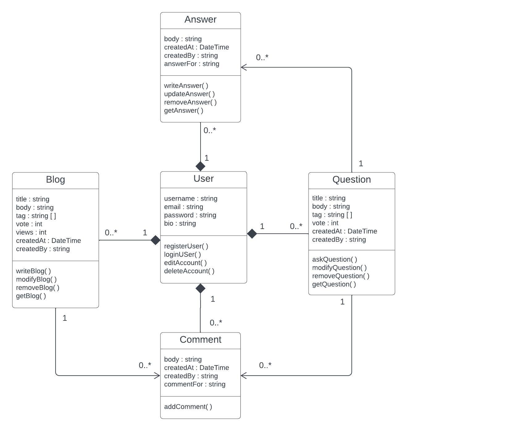
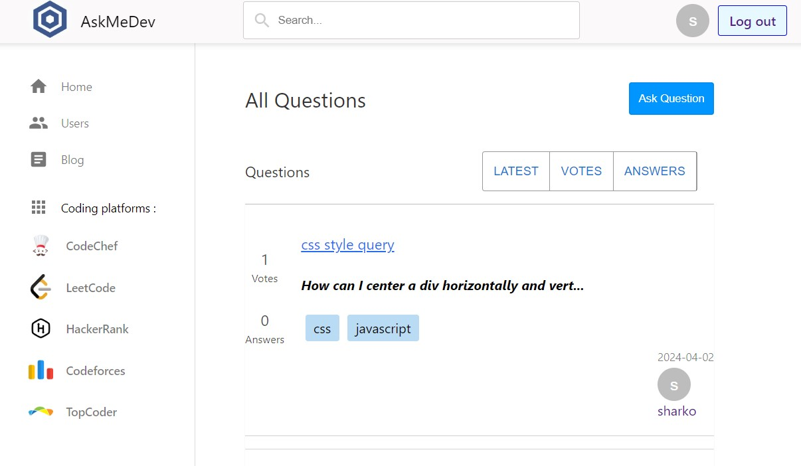
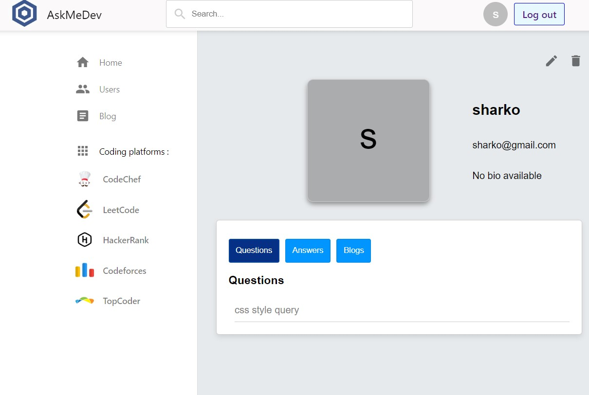
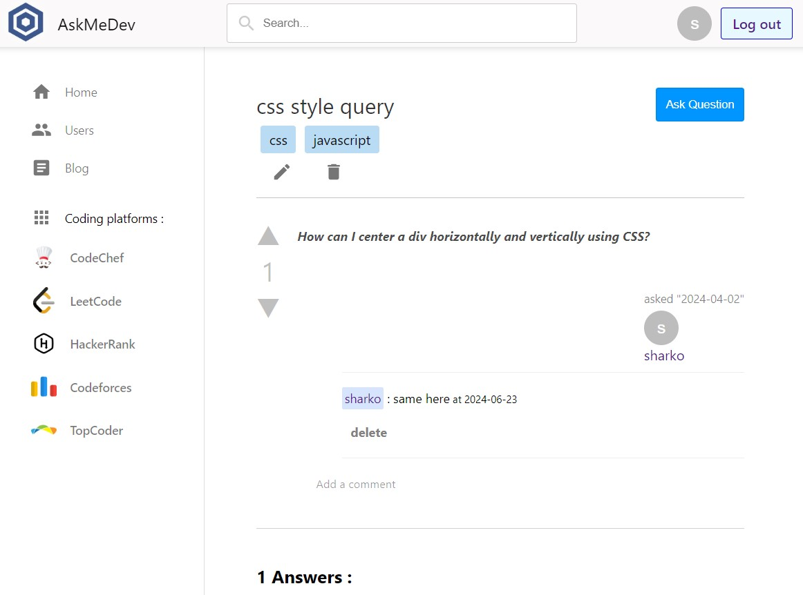
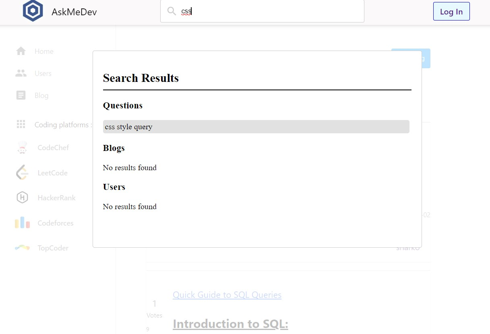

# AskMeDev : programming discussion platform
#### try out live <a href='https://ask-me-dev.vercel.app'>here</a>
#### Tech stack : Express, React, MongoDB, Socket.io, Firebase auth, Docker

## Major features :
1. realtime comments, answers and votes with socket.io
2. jwt token base api authorization
3. user authentication with firebase
4. manage user account and view contributions
5. search questions, answers and blogs
6. ask questions, comment and answer questions or write blog

## Class Diagram : 

## System Screenshots : 

#### 1. home page

#### 2. dashboard page

#### 3. question page

#### 4. search
